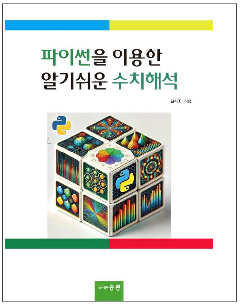

  

# NA_with_python  
### 파이썬을 이용한 알기쉬운 수치해석  
홍릉출판

---

## Chapter 1. 파이썬의 이해

> 교재 본문에 포함된 Python 예제 코드만 정리  
> 연습문제 코드는 포함하지 않음

| Section | Topic | Code |
|--------|------|------|
| 1.1 | 파이썬의 특징 | [section_01_01_features.py](chapter01/section_01_01_features.py) |
| 1.2 | 변수 선언 | [section_01_02_variables.py](chapter01/section_01_02_variables.py) |
| 1.3 | 배열과 행렬 | [section_01_03_arrays_matrices.py](chapter01/section_01_03_arrays_matrices.py) |
| 1.4 | 튜플 | [section_01_04_tuples.py](chapter01/section_01_04_tuples.py) |
| 1.5 | 사전 | [section_01_05_dictionary.py](chapter01/section_01_05_dictionary.py) |
| 1.6 | 연산자 및 NumPy | [section_01_06_operators_numpy.py](chapter01/section_01_06_operators_numpy.py) |
| 1.7 | 반복 계산 | [section_01_07_loops.py](chapter01/section_01_07_loops.py) |
| 1.8 | 조건 계산 | [section_01_08_conditionals.py](chapter01/section_01_08_conditionals.py) |
| 1.9 | 입출력 | [section_01_09_io.py](chapter01/section_01_09_io.py) |
| 1.10 | 함수 | [section_01_10_functions.py](chapter01/section_01_10_functions.py) |
| 1.11 | NumPy 벡터·행렬 | [section_01_11_numpy_linear_algebra.py](chapter01/section_01_11_numpy_linear_algebra.py) |
| 1.12 | 객체지향(OOP) | [section_01_12_oop.py](chapter01/section_01_12_oop.py) |
| 1.13 | matplotlib 시각화 | [section_01_13_matplotlib.py](chapter01/section_01_13_matplotlib.py) |

---

## Chapter 2. 비선형 방정식의 근 구하기

> 교재 본문에 포함된 Python 예제 코드만 정리  
> 연습문제 코드는 포함하지 않음

| Section | Topic | Code |
|--------|------|------|
| 2.2 | 점진탐색법 | |
| 2.2.3 | 점진탐색법 함수 구현 | [section_02_02_incremental_search.py](chapter02/section_02_02_incremental_search.py) |
| 2.2.5 | 중근을 갖는 경우 | [section_02_02_05_incremental_search_multiple_root.py](chapter02/section_02_02_05_incremental_search_multiple_root.py) |
| 2.3 | 이분법 | |
| 2.3.2 | 이분법 알고리즘 | [section_02_03_02_bisection_algorithm.py](chapter02/section_02_03_02_bisection_algorithm.py) |
| 2.3.3 | SciPy 이분법 | [section_02_03_03_bisection_scipy.py](chapter02/section_02_03_03_bisection_scipy.py) |
| 2.4 | 뉴턴–랩슨법 | |
| 2.4.4 | 뉴턴–랩슨법 함수 구현 | [section_02_04_04_newton_raphson_function.py](chapter02/section_02_04_04_newton_raphson_function.py) |
| 2.4.6 | SciPy 뉴턴–랩슨법 | [section_02_04_06_newton_scipy.py](chapter02/section_02_04_06_newton_scipy.py) |

---

## Chapter 3. 선형연립방정식 수치해법

> 교재 본문에 포함된 Python 예제 코드만 정리  
> 연습문제 코드는 포함하지 않음

| Section | Topic | Code |
|--------|------|------|
| 3.1.3 | 행렬의 선형변환 | [section_03_01_03_linear_transformation.py](chapter03/section_03_01_03_linear_transformation.py) |
| 3.1.4 | 행공간과 영공간 | [section_03_01_04_row_null_space.py](chapter03/section_03_01_04_row_null_space.py) |
| 3.2.3 | 전진 소거 알고리즘 | [section_03_02_03_forward_elimination.py](chapter03/section_03_02_03_forward_elimination.py) |
| 3.2.4 | 후진 대입 | [section_03_02_04_back_substitution.py](chapter03/section_03_02_04_back_substitution.py) |
| 3.2.5 | 가우스 소거법 전체 구현 | [section_03_02_05_gaussian_elimination_full.py](chapter03/section_03_02_05_gaussian_elimination_full.py) |
| 3.2.6 | 부분 피벗팅 | [section_03_02_06_partial_pivoting.py](chapter03/section_03_02_06_partial_pivoting.py) |
| 3.3.5 | Doolittle LU 분해 (문제1) | [section_03_03_05_doolittle_lu_problem1.py](chapter03/section_03_03_05_doolittle_lu_problem1.py) |
| 3.3.5 | Doolittle LU 분해 + 해 구하기 | [section_03_03_05_doolittle_lu_solve.py](chapter03/section_03_03_05_doolittle_lu_solve.py) |
| 3.3.6 | Crout LU 분해 | [section_03_03_06_crout_lu_decomposition.py](chapter03/section_03_03_06_crout_lu_decomposition.py) |
| 3.3.8 | SciPy LU 분해 | [section_03_03_08_lu_scipy.py](chapter03/section_03_03_08_lu_scipy.py) |
| 3.3.9 | SciPy LU로 연립방정식 풀이 | [section_03_03_09_lu_solve_scipy.py](chapter03/section_03_03_09_lu_solve_scipy.py) |
| 3.3.10 | LU vs numpy.linalg.solve 비교 | [section_03_03_10_lu_vs_numpy_solve.py](chapter03/section_03_03_10_lu_vs_numpy_solve.py) |
| 3.4.2 | Jacobi 반복법 | [section_03_04_02_jacobi_method.py](chapter03/section_03_04_02_jacobi_method.py) |
| 3.4.3 | Gauss–Seidel 반복법 | [section_03_04_03_gauss_seidel_method.py](chapter03/section_03_04_03_gauss_seidel_method.py) |
| 3.4.4 | SOR 반복법 | [section_03_04_04_sor_method.py](chapter03/section_03_04_04_sor_method.py) |
